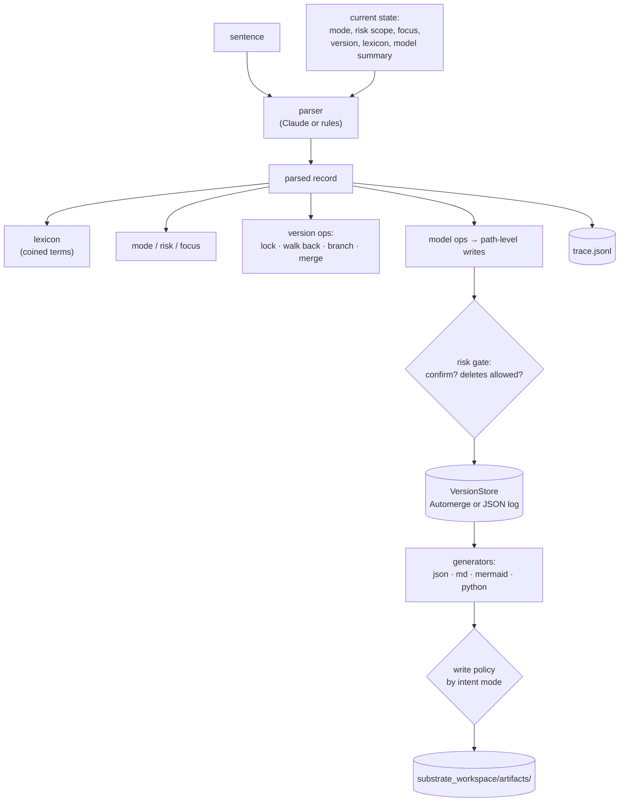

# substrate

A command-line REPL that turns plain-English sentences into one structured, versioned graph model, and generates JSON, Markdown, Mermaid and Python stubs from it.

<!--  -->
<!--  -->

```
[ideation · dev · @root · v0.0.1] › ignition feeds into cooling
  + implied node cooling from an edge
  + linked ignition → cooling (feeds into)
  ▸ v0.0.2
  → artifacts/model.json
```

## Why I built this

I think out loud, often away from a keyboard. I wanted to describe a system in plain English and have it captured as a structured model I can version, inspect and generate from, instead of a transcript I'd have to re-read. The structured capture is the artifact; the outputs are disposable and can be regenerated at any time. Because it's an agent that writes files, I also wanted it to know the difference between me thinking aloud and me committing to something, and between a sandbox and something that matters.

## What it does

- Turns each sentence into a parsed record: intent mode, scope and version actions, a system command, model operations (`add_node`, `add_edge`, `set_attr`, `add_note`, and so on), suggested outputs, and any newly coined terms.
- Applies those operations to a single graph model (nodes, edges, notes, metadata) and commits a version that carries the sentence that produced it.
- Generates `model.json`, `model.md`, `model.mmd` (Mermaid) and `model_stub.py` (dataclass scaffolding) from the model. How many of them reach disk depends on the intent mode.
- Tracks two independent settings on every turn, intent mode and risk scope, which control what gets written and what needs your confirmation.
- Maps plain-language version operations ("lock it in", "walk it back to 0.0.2", "branch off that as coldstart", "merge coldstart back in") onto an Automerge CRDT, with a JSON-log fallback.
- Grows a domain vocabulary from use. "When I say X, I mean Y" is stored and injected into the parser's context on every later turn.
- Logs every turn as raw sentence → parsed record → version → files written, viewable with `show me the log`, `describe 0.0.2` and `diff 0.0.1 0.1.1`.
- Works offline with a rule-based parser and no API key.

## Use cases

- Sketching a system or business process by talking it through, one sentence at a time, and ending up with a graph instead of notes.
- Turning a rambling idea into a structured spec: components, relations and open notes, with the original phrasing kept on every version.
- Generating a first-pass Mermaid diagram and a Python data model from a description.
- Keeping a versioned record of how a model evolved, including the branches you tried and abandoned.

## Quick start

### Requirements

- Python 3. I verified it on Python 3.11.7 on macOS 15.8 (Apple Silicon).
- `automerge==1.0.0rc1`, which ships prebuilt wheels for macOS (arm64 and x86_64), Linux and Windows. If it won't install on your platform, run with `--backend jsonlog`.
- Optional: an Anthropic API key for real language understanding.

### Install and run

```bash
python3 -m venv .venv
```

```bash
.venv/bin/pip install -r requirements.txt
```

```bash
.venv/bin/python substrate.py --dry-run
```

`--dry-run` uses the offline rule-based parser. To use Claude:

```bash
export ANTHROPIC_API_KEY=...
```

```bash
.venv/bin/python substrate.py
```

Everything is written under `substrate_workspace/` in the repo folder, unless you point `--workspace` somewhere else.

| Flag | Does |
| --- | --- |
| `--dry-run` | Skip the API and use rule-based parsing |
| `--model ID` | Override the Claude model for this run (default in `config.py`) |
| `--backend automerge\|jsonlog` | Pick the version store |
| `--workspace PATH` | Use a different sandbox directory |
| `--yes` | Auto-confirm staging and production prompts (for scripted demos) |

### A scripted demo

This runs offline and shows most of the features. Paste the lines one at a time into a `--dry-run` session, or pipe them in:

```bash
printf '%s\n' "add a component called ignition" "ignition feeds into cooling" "lock it in" "when I say a spine, I mean the load-bearing path through the system" "drill into the engine bay" "switch to execution mode" "add a component called exhaust" "walk it back to 0.0.2" "diff 0.0.1 0.1.1" "branch off that as coldstart" "show me the log" | .venv/bin/python substrate.py --dry-run --yes
```

| Line | Shows |
| --- | --- |
| 1–2 | Sentences becoming graph structure; `cooling` is implied by an edge before it is described |
| 3 | Locking a milestone: the minor version bumps to `v0.1.0` |
| 4 | Coining a term, written to the lexicon |
| 5 | Scoping: focus becomes `@root/engine-bay`, and artifacts are written under `artifacts/engine-bay/` |
| 6 | Intent mode change: in execution mode all four formats are written |
| 7 | Multi-format generation: JSON, Markdown, Mermaid and Python together |
| 8 | Walking back: `v0.0.2` becomes the base, and the sentence that produced it is shown |
| 9 | A path-level diff plus Automerge's own patch count |
| 10 | Branching: a real Automerge fork; the prompt becomes `coldstart:v0.0.2` |
| 11 | The full trace |

### Configuration

| Variable | Required | What it does |
| --- | --- | --- |
| `ANTHROPIC_API_KEY` | No | Enables Claude-based parsing. Without it, substrate warns at startup and falls back to the rule-based parser. |
| `ANTHROPIC_AUTH_TOKEN` | No | Alternative credential the Anthropic SDK accepts. |

substrate doesn't read a `.env` file; export the variables in your shell. See [`.env.example`](.env.example). The model ID, sandbox path, and the write and confirmation policies are constants in [`config.py`](config.py).

### Running without an API key

With `--dry-run`, or with no key set, the parser is a set of regular expressions. It handles the meta-commands, the coining patterns ("when I say X, I mean Y", "let's call that X", "X means Y"), and a few modeling shapes: "add/create a component called X", "X feeds into / connects to / depends on Y", "call the model X", and "remove X". Anything else is stored as a note. Phrasing has to be fairly literal. Versioning, branching, merging, generation, the trace and the risk gates all work exactly as they do with the API.

## How it works



Start with `substrate.py`: `run_turn` is one turn end to end, and the numbered comments inside it give the order things happen in. `parser.py` holds the parsed-record dataclass, the JSON schema the Claude parser is constrained to, the system prompt, and the rule-based parser. `version_store.py` turns model operations into path-level writes and defines the `VersionStore` interface with its two backends. `state.py` has the two settings, the focus pointer, the confirmation gate, and the check that keeps every write inside the sandbox. `generators.py` is four pure functions from model to text. `lexicon.py` and `trace.py` are small.

The Claude parser uses the Messages API with structured outputs (a JSON schema in `output_config`) and prompt caching on the system prompt. If structured output is rejected, it retries asking for plain JSON. If the call fails outright, it falls back to the rule-based parser for that turn and records why in the trace.

## Design decisions

**One structured graph, many disposable outputs.** The model in the version store is the only state that matters. Markdown, Mermaid and the Python stub are regenerated from it as pure string transforms, and the parser suggests which ones a given sentence calls for. Generating several at once costs nothing measurable, and there's no question of which artifact is authoritative. The cost is that the outputs are views, not editable sources: the Python stub says "do not edit", and hand edits to any artifact are overwritten on the next write.

**Two independent controls: intent mode and risk scope.** This is a trust-and-safety design for an agent that writes files. Intent mode (ideation, evaluation, execution) decides how eagerly output hits disk: ideation writes only JSON and previews the rest in the terminal, evaluation adds Markdown and Mermaid, and execution adds code. Risk scope (dev, staging, production) decides how contained the consequences are: dev never asks, staging and production confirm every write and structural change, and production refuses deletions outright. The two move independently, so you can explore freely in production or commit hard in dev. Separately, every artifact path is resolved and checked against the sandbox root before writing. The cost is two settings to keep in your head (the prompt shows both at all times), and the API parser can infer a mode change from your phrasing, which can surprise you.

**Versioning in plain language.** "Lock it in" seals a milestone and bumps the minor version, "walk it back to 0.0.2" makes an old snapshot the base again, "branch off that" forks, and "merge X back in" merges. Every sentence that changes the model also commits a patch version carrying the sentence itself, so provenance never has gaps. The cost is a lot of versions, and version numbers come from one global counter: after walking back to `v0.0.2`, the next commit is `v0.1.2`, not something that shows its lineage.

**Automerge for real branching and merging, behind an interface.** The default store is an Automerge document per branch: `branch` is a real fork and `merge` is a real CRDT merge. Writes are applied at node granularity, so concurrent edits to different nodes on two branches merge cleanly. The `VersionStore` interface also has an append-only JSON-log implementation with no native dependency, used with `--backend jsonlog` or automatically if Automerge fails to import. The cost is a pinned release candidate (`1.0.0rc1`), because the stable 0.1.2 needs a Rust toolchain and has no macOS wheel. The JSON-log backend's merge is last-write-wins per node, which is honest but not a CRDT.

**A vocabulary that starts empty.** Terms you coin are written to `substrate_workspace/lexicon.json` with the version and sentence they came from, and the whole lexicon is injected into the parser's context on every turn. A term coined at turn 3 changes how turn 4 is read. The repo ships no lexicon; it builds up per workspace. The cost is a prompt that grows with your vocabulary, and the offline parser records coinages but doesn't apply them.

**Inspectable execution.** Every turn is appended to `trace.jsonl`: the raw sentence, the full parsed record (including the parser's one-sentence rationale), the resulting version, the files written and any side effects. `show me the log`, `describe <version>` and `diff <a> <b>` read from it and from the store, so you can see where the capture drifted from what you meant. The fix is to walk back and say it again. The cost is a trace that grows without bound. There's also no way to edit a past parse in place.

## Limitations and known issues

- Input is typed text. The input path is a single `input()` call, so voice could replace it without touching anything else, but there's no voice input today.
- The offline parser is a handful of regexes. It needs literal phrasing, and it stores coined terms without applying them.
- A merge updates the branch's working model but doesn't create a new version, so `describe` and `diff` can't refer to the merge itself until the next change is committed.
- `describe` returns the stored sentence and the parser's note; it doesn't narrate what changed in prose.
- There are no automated tests. I verified this release by running the scripted demo above, a merge between two branches, the JSON-log backend, and startup with no API key.
- The Claude parser's model ID is a single constant in `config.py` (`MODEL_ID`). I didn't exercise the API path while preparing this release.
- Out of scope for now: mobile, multi-user sync, remote execution.

## Project status

Personal project, paused. Last meaningful change: August 25, 2026.

## Built with

Python, the Anthropic Python SDK (Messages API with structured outputs), and Automerge (Python bindings). Designed by Matt Burke; built with Claude Code.

Related projects: [vsm-translator](https://github.com/more-reese/vsm-translator) (text and BPMN/VSM diagrams kept in sync) and [lenswork](https://github.com/more-reese/lenswork) (one case, eight reasoning lenses). lenswork used to live inside this repo and now has its own.

## License

MIT. See [LICENSE](LICENSE).
